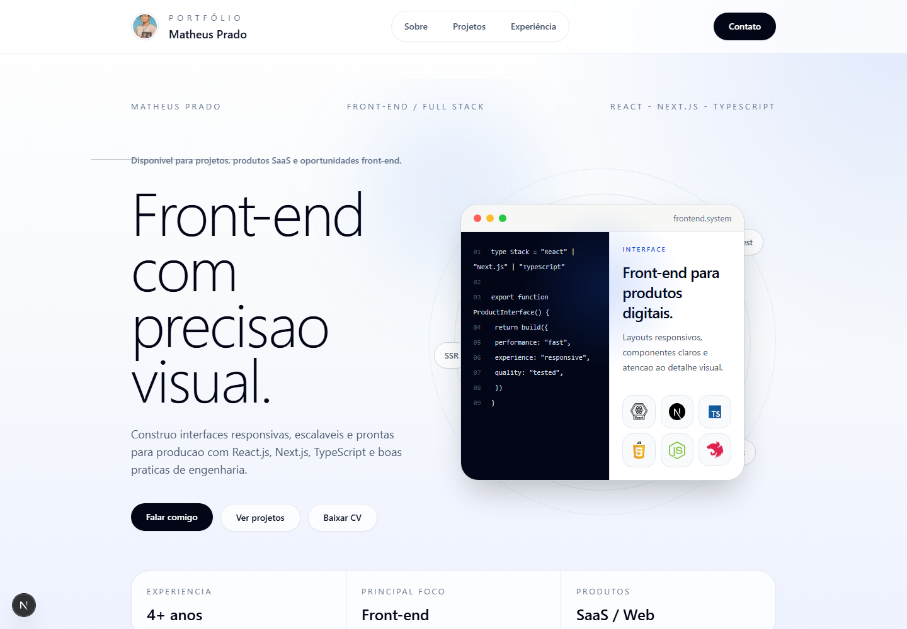
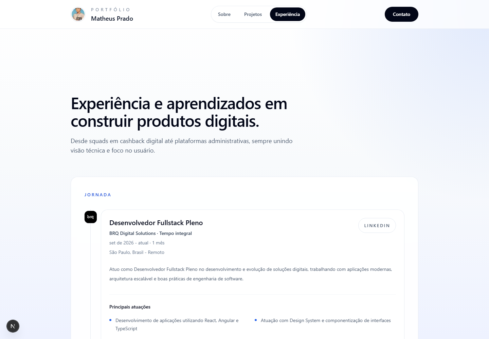
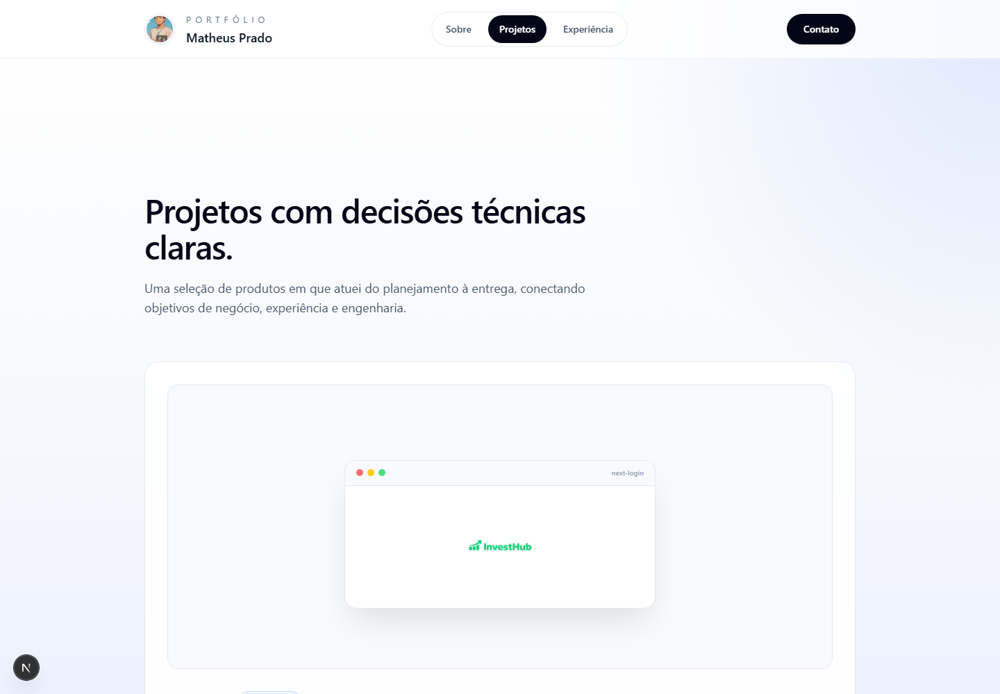

# Matheus Prado — Portfólio

Portfólio pessoal em Next.js, React, Tailwind CSS e componentes shadcn/ui.

## Preview

### Início



### Experiência



### Projetos



## Rodar

```bash
npm install
npm run dev
```

## Validar

```bash
npm run check
```

## Variáveis

```env
NEXT_PUBLIC_SITE_URL=https://seu-dominio.com
```

## Estrutura

- `src/pages`: rotas e conteúdo
- `src/components`: componentes reutilizáveis
- `src/components/ui`: componentes shadcn/ui
- `src/lib`: utilitários e geração de RSS
